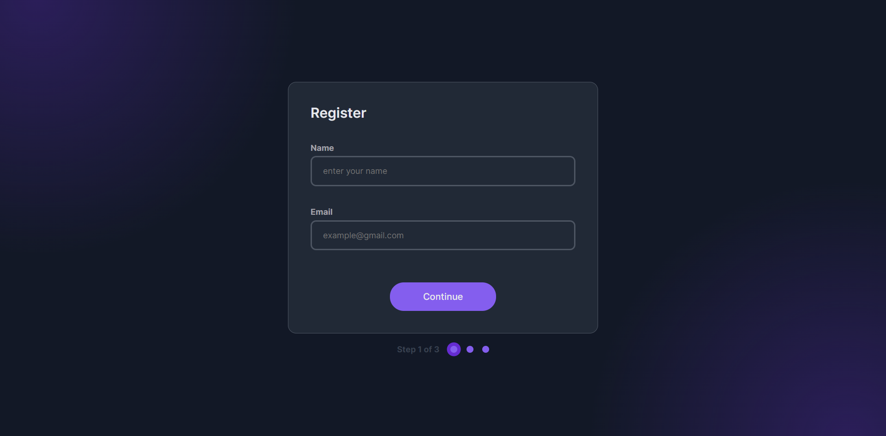
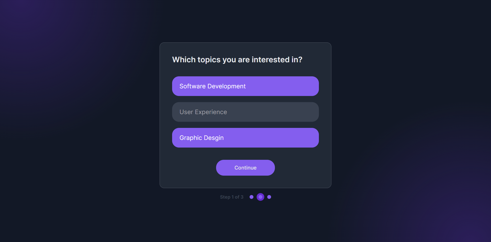
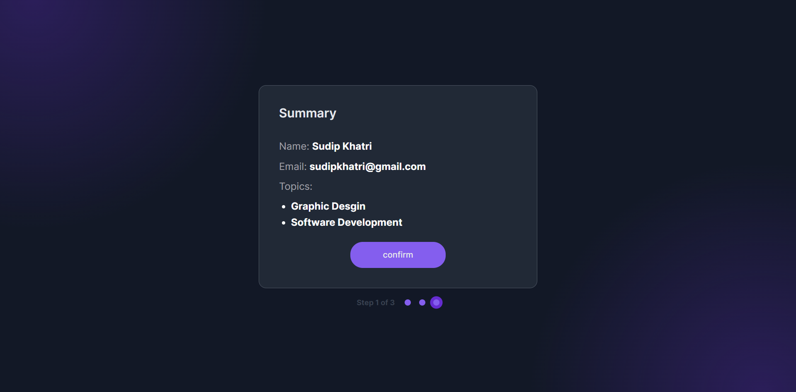
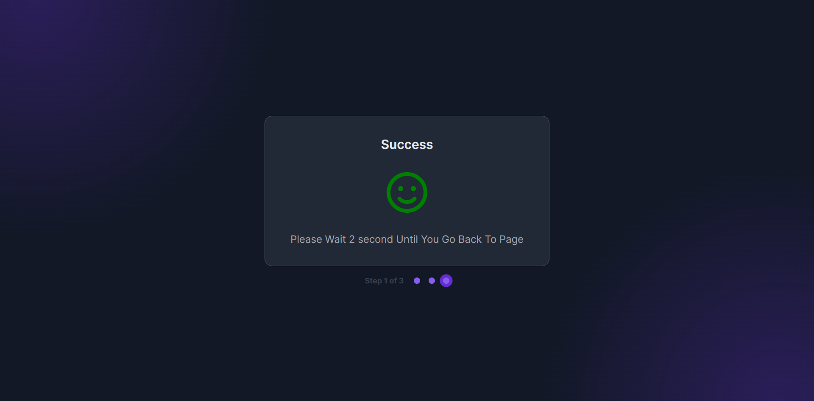
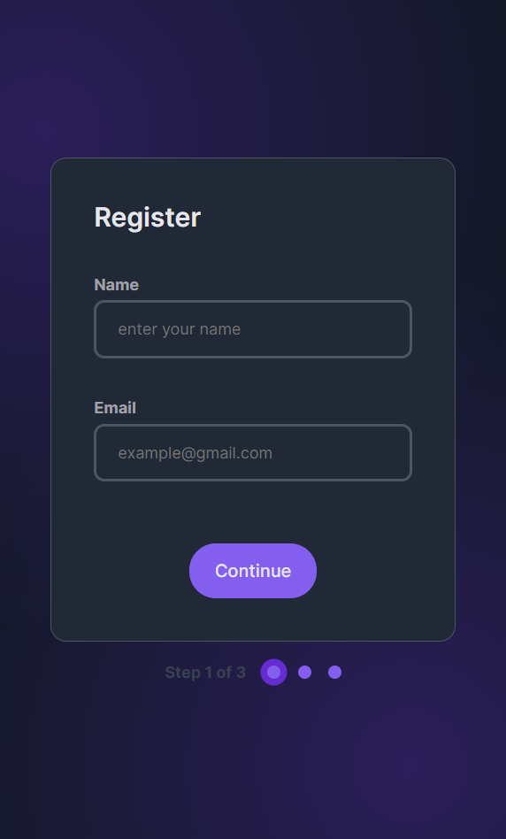

# Dev Challenges - Multi Step Form

This is a solution to the [Multi Step From challenge on Dev Challenges](https://devchallenges.io/challenge/multi-step-register-form). Frontend Mentor challenges help you improve your coding skills by building realistic projects.

## Table of contents

- [Overview](#overview)
  - [The challenge](#the-challenge)
  - [Screenshot](#screenshot)
  - [Links](#links)
- [My process](#my-process)
  - [Built with](#built-with)
  - [What I learned](#what-i-learned)
  - [Continued development](#continued-development)
  - [Useful resources](#useful-resources)
- [Author](#author)

## Overview

### The challenge

Users should be able to:

- View the optimal layout for the site depending on their device's screen size
- See hover states for all interactive elements on the page
- Create a multi-step registration page that matches the given design.
- Add validations to the inputs: name and email input should be required and email input should only accept email format.
- Users should not be able to continue to the next step if inputs are empty or the topic is not selected Users can continue to the next step if inputs are filled or topic is selected.
- When users click confirm, they should see an alert with '✅ Success' message.
- Users should know which step they are at.

### Screenshot

### Links

- Live Site URL: [https://devchallengmultistepform.netlify.app/](https://devchallengmultistepform.netlify.app/)

## My process

### Built with

- Semantic HTML5 markup
- CSS custom properties
- Flexbox
- Array Methods
- Vanilla JS

### What I learned

Form Validation, Ways to change UI, Adding Animation on display none to block property, Showing Success Message, Handling Userdata

### Continued development

I will continue to focus on improving writing javascript code clean effecient and more maintainable. I will continue learning problem solving skill and make more and more project. I will keep improving in this areas and make websites more interactive.

### Useful resources

- [Google, Stackoverflow](https://www.google.com/) - This helped me for finding usefull methods and getting confidence my ideas.

## Author

- Website - [Sudip khatri](https://sudipkhatri.netlify.app/)
- Dev Challenges - [@SudipKhatri](https://devchallenges.io/profile/668a4472-7c2c-4f92-9b06-80c7ed9577bd)
- Linkedin - [@SudipKhatri](https://www.linkedin.com/in/sudip-khatri-a72a6a27b/)
